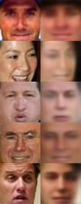
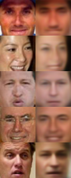
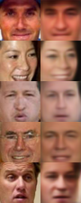
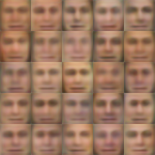
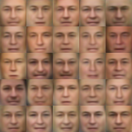
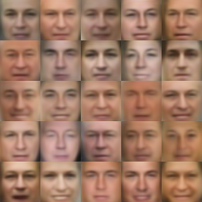
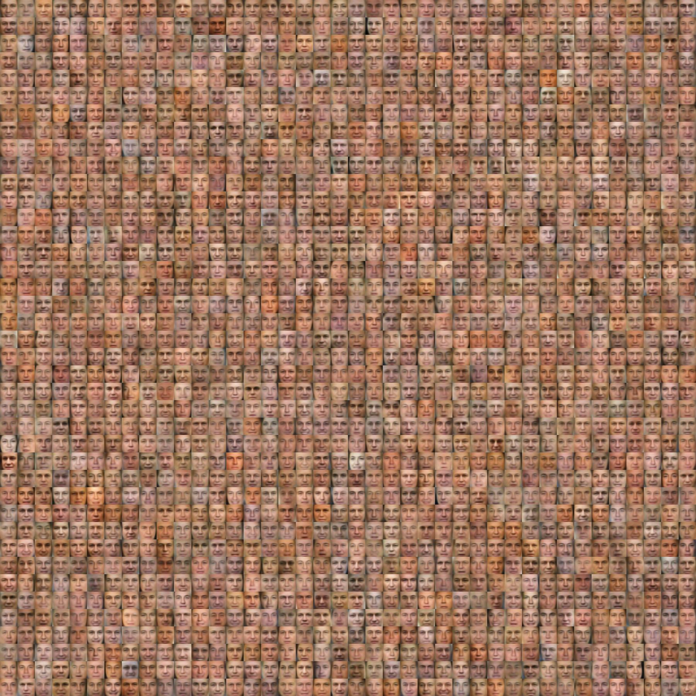

# Variational-Autoencoder-VAE-
A Variational Autoencoder (VAE) is a powerful deep learning model that can learn a compressed representation of input data and generate new samples. It consists of an encoder network that maps the input data to a lower-dimensional latent space, capturing essential features. By introducing stochasticity, VAEs enable the generation of diverse and realistic outputs. The decoder network reconstructs the original input based on the sampled latent vectors, and the model is trained to minimize the reconstruction loss. VAEs provide a versatile framework for unsupervised learning, data compression, and creative generation tasks.

# Validation Results for Reconstruction
# Epochs: 1, 20, 50, 100

#
# Generative Results:
# Epochs: 1, 20, 50, 100

  

# Final Generative Results:

